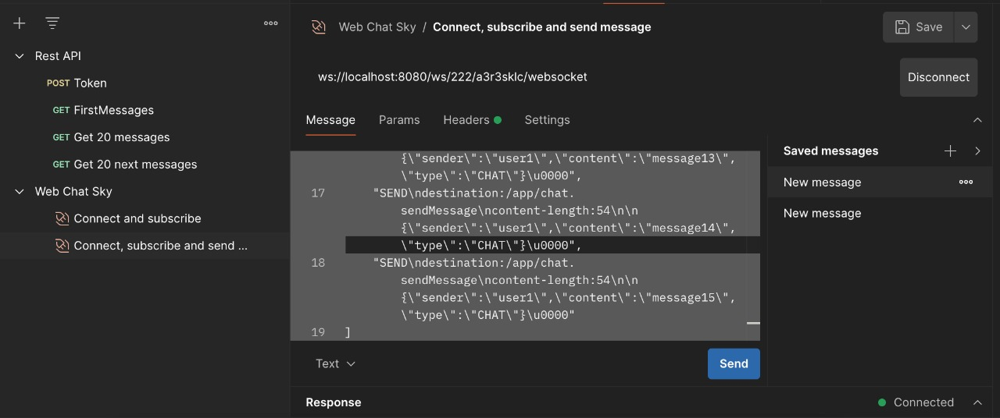

# ♻️ `Sky messenger`

Welcome to the `Sky messenger` application.
Sky Messenger is an application that allows users to exchange messages in real-time.

## 🚀 Quick Start

To get the application up and running, launch docker-compose, execute the following command:

```
make run
```

To run `Tests`, use the following command:

```
make test
```

To run `Unit Tests`, use the following command:

```
make unit-test
```

To run `Integration Tests`, use the following command:

```
make integration-test
```

For `manual testing` of the project, a Postman configuration is provided at:
[Postman](https://www.postman.com/navigation-engineer-1111249/workspace/sky/request/13822281-30122fa6-1344-41c7-b4d5-3d2ea01f508b)

For manual testing:

First, we need to authenticate. To do this, we can send a Token request, which retrieves the token and automatically uses it for all subsequent requests.


After that, we can use Websocket to authenticate and send several messages to the chat "Connect, subscribe and send message".

At the same time, we immediately receive these messages from WebSocket in both the current and all connections.




After this, we can retrieve the last 20 messages "Get 20 messages".


Also, we can retrieve messages that come after a specific message. For example, select a message, note its date and ID, and then use it in the request "Get 20 next messages".
Example:
http://localhost:8080/messages?startDate=2024-03-26T09:04:06.917&lastMessageId=d278f16d-528e-4e6e-89ec-c984c47754af&batchSize=20

